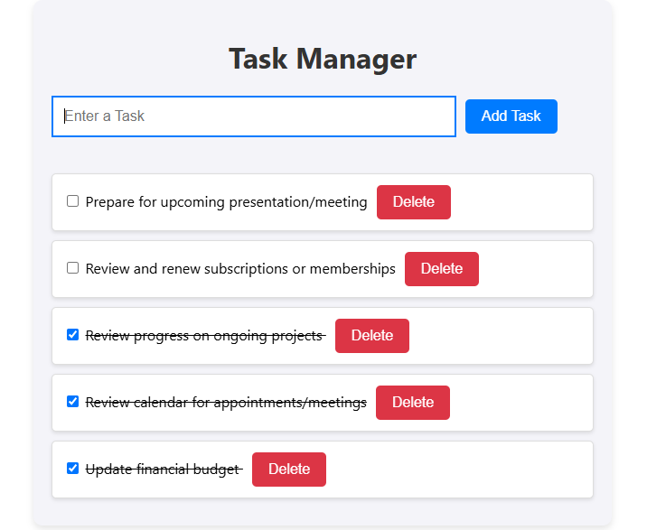

# Task Manager

A simple and intuitive **React Task Manager Application** that allows users to manage their daily tasks efficiently. This app uses **localStorage** to save tasks, ensuring they persist even after refreshing the browser.

## Live Demo

Check out the live demo of the application:  
[Task Manager Live Demo](https://medbendakkoum.github.io/Task-Manager/)

## Features

- Add new tasks with ease.
- Mark tasks as complete.
- Delete tasks you no longer need.
- Tasks are stored in **localStorage**, so your data is safe between browser sessions.

## Technologies Used

- **React**: A powerful JavaScript library for building user interfaces.
- **LocalStorage**: For persisting tasks across page refreshes.
- **GitHub Pages**: For hosting and deploying the application.

## Screenshot



## Getting Started

Follow these instructions to run the project locally:

### Prerequisites

- Node.js installed on your machine.
- A basic understanding of Git and React.

### Installation

1. Clone the repository:
   ```bash
   git clone https://github.com/MedBenDakkoum/Task-Manager.git
   ```
2. Navigate to the project directory:
   ```bash
   cd task-manager
   ```
3. Install the dependencies:
   ```bash
   npm install
   ```

### Running Locally

1. Start the development server:
   ```bash
   npm start
   ```
2. Open your browser and visit `http://localhost:3000` to view the app.

### Building for Production

To create an optimized production build, run:

```bash
npm run build
```

The production-ready files will be located in the `build` folder.

## Deployment

This project can be easily deployed using platforms like [Netlify](https://www.netlify.com/) or [GitHub Pages](https://pages.github.com/).

### Deploying to Netlify

1. Build the project:
   ```bash
   npm run build
   ```
2. Use the Netlify CLI:
   ```bash
   npm install -g netlify-cli
   netlify login
   netlify init
   netlify deploy --prod
   ```

### Deploying to GitHub Pages

1. Install the GitHub Pages package:
   ```bash
   npm install gh-pages --save-dev
   ```
2. Add the following scripts to your `package.json`:
   ```json
   "homepage": "https://MedBenDakkoum.github.io/Task-Manager",
   "scripts": {
     "predeploy": "npm run build",
     "deploy": "gh-pages -d build"
   }
   ```
3. Deploy to GitHub Pages:
   ```bash
   npm run deploy
   ```

## License

This project is licensed under the MIT License. See the [LICENSE](LICENSE) file for details.

## Author

**Mohamed Ben Dakkoum**

Feel free to contribute or report issues!
